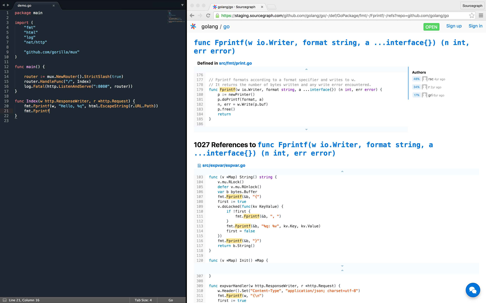

# Sourcegraph Live Sublime Plugin

## Overview

The Sourcegraph Sublime Plugin allows you to view Go definitions in real-time on [sourcegraph.com](http://www.sourcegraph.com) as you code, so you can stay focused on what's important: your code. When your cursor is on a certain Go symbol, it should load in a live channel in your browser:



## Setup

1. The plugin assumes `godef` is present at `$GOPATH/bin/godef`. If you don't already have it, you need install `godef`:

	`go get -v github.com/rogpeppe/godef`

2. Navigate to the Sublime Text Packages directory (the directory can be found in Sublime by clicking `Sublime Text > Preferences > Browse Packages...`) and clone the `sg-sublime` plugin:

 	`git clone https://github.com/luttig/sg-sublime`

3. Open `Sourcegraph.sublime-settings` by clicking `Sublime Text > Preferences > Package Settings > Sourcegraph > Settings - User`, and add your GOPATH and GOROOT as follows:

	```json
{
	"GOPATH": "/path/to/gopath",
	"GOROOT": "/usr/local/go"
}
	```

Similarly, if you want to try the plugin on a local Sourcegraph server, you can define its base URL in this file using the key `SG_BASE_URL`.

 3. 

 ## Usage

The plugin should automatically open a browser tab to initialize your live session when in Go files. If, for any reason, your tab gets closed, press <kbd>&#8984;</kbd>+<kbd>.</kbd>, <kbd>&#8984;</kbd>+<kbd>0</kbd> in any file to reopen the Sourcegraph live tab. Alternatively, you can click on `Sublime Text > Preferences > Package Settings > Sourcegraph > Reopen Browser Tab`. As you navigate through Go files, your browser should automatically load the definition and references for recognized symbols.